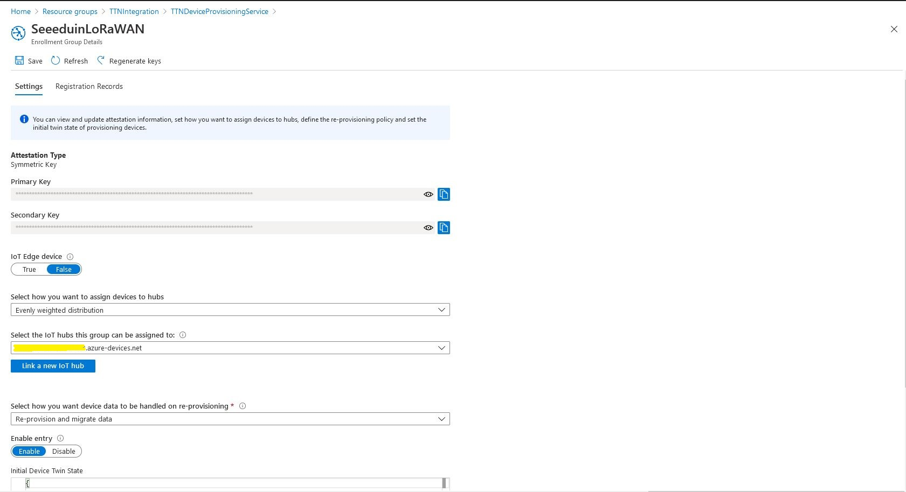
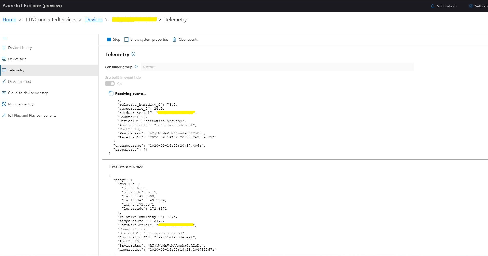
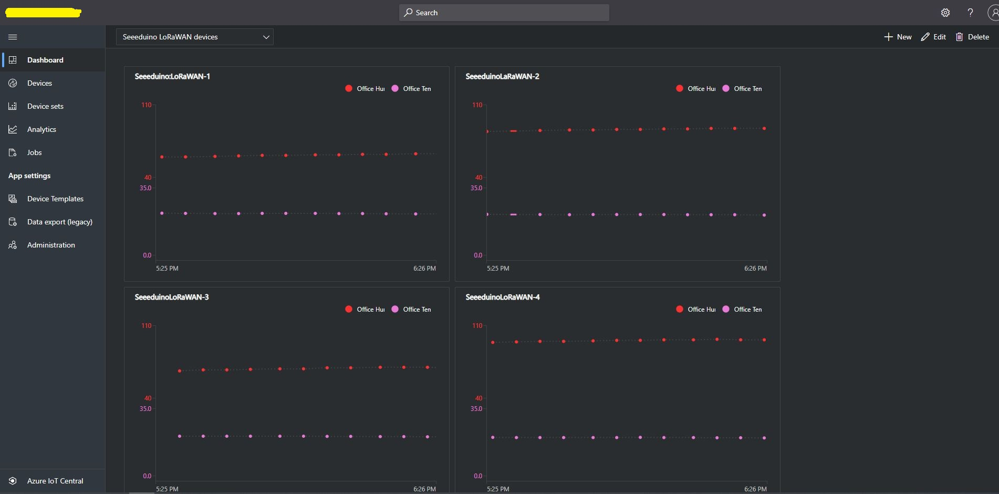

# AzureIoTTheThingsNetworkIntegration
A [The Things Network](https://www.thethingsnetwork.org/) HTTP Integration for [Azure IoT Hubs](https://azure.microsoft.com/en-us/services/iot-hub?WT.mc_id=IoT-MVP-5001375) 
or [Azure IoT Central instances](https://docs.microsoft.com/en-us/azure/iot-central/core/overview-iot-central?WT.mc_id=IoT-MVP-5001375)

The repo has the source code for the series of blog posts written as I built this solution. There are also overviews of configuring the integration to work 
with [Azure DPS + IoT Hubs](http://blog.devmobile.co.nz/2020/09/16/the-things-network-http-azure-iot-hub-integration/) and [Azure IoT Central](http://blog.devmobile.co.nz/2020/09/17/the-things-network-http-azure-iot-central-integration/)

1. [Infrastructure and payloads](http://blog.devmobile.co.nz/2020/08/31/the-things-network-http-integration-part1/)
2. [Basic JSON Deserialisation](http://blog.devmobile.co.nz/2020/09/01/the-things-network-http-integration-part2/)
3. [When Serialisation goes bad-payload_fields](http://blog.devmobile.co.nz/2020/09/02/the-things-network-http-integration-part3/)
4. [Out stupiding myself](http://blog.devmobile.co.nz/2020/09/03/the-things-network-http-integration-part4/)
5. [First TTN payload to the cloud](http://blog.devmobile.co.nz/2020/09/04/the-things-network-http-integration-part5/)
6. [Provisioning Devices on demand](http://blog.devmobile.co.nz/2020/09/05/the-things-network-http-integration-part6/)
7. [Queuing uplink messages](http://blog.devmobile.co.nz/2020/09/09/the-things-network-http-integration-part7/)
8. [Logging and the start of simplification](http://blog.devmobile.co.nz/2020/09/10/the-things-network-http-integration-part8/)
9. [Simplicating and securing the HTTP handler](http://blog.devmobile.co.nz/2020/09/11/the-things-network-http-integration-part9/)
10. [Assembling the components](http://blog.devmobile.co.nz/2020/09/15/the-things-network-http-integration-part10/)

The solution uses the [Azure Device Provisioning Service(DPS)](https://docs.microsoft.com/en-us/azure/iot-dps/about-iot-dps?WT.mc_id=IoT-MVP-5001375) [Group Enrollments with Symmetric Keys](https://docs.microsoft.com/en-us/azure/iot-dps/concepts-symmetric-key-attestation?WT.mc_id=IoT-MVP-5001375) to "automagically" provision devices in Azure IoT Hus and Azure IoT Central instances.

The key projects are a pair of [Azure Functions](https://docs.microsoft.com/en-us/azure/azure-functions/functions-overview). 

[TTNHttpIntegrationUplinkEndpoint](https://github.com/KiwiBryn/AzureIoTTheThingsNetworkIntegration/tree/master/TTNHttpIntegrationUplinkEndpoint) which places uplink messages from TTN into a [Azure Storage Queue](https://docs.microsoft.com/en-us/azure/storage/queues/storage-queues-introduction?WT.mc_id=IoT-MVP-5001375) and [AzureIoTHubUplinkMessageProcessor](https://github.com/KiwiBryn/AzureIoTTheThingsNetworkIntegration/tree/master/AzureIoTHubUplinkMessageProcessor) which processes the queue provisioning devices and sending telemetry events. 

